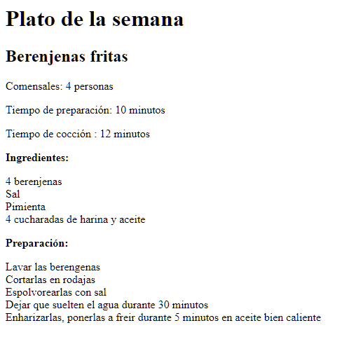
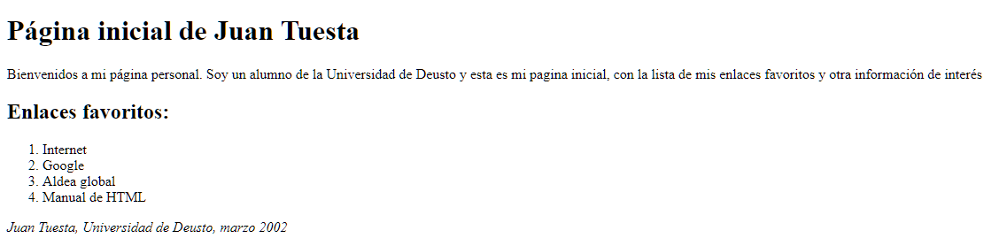
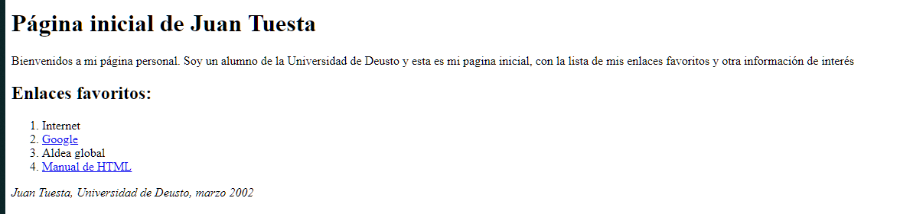
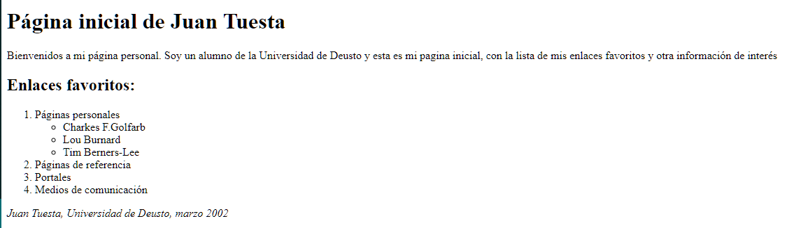
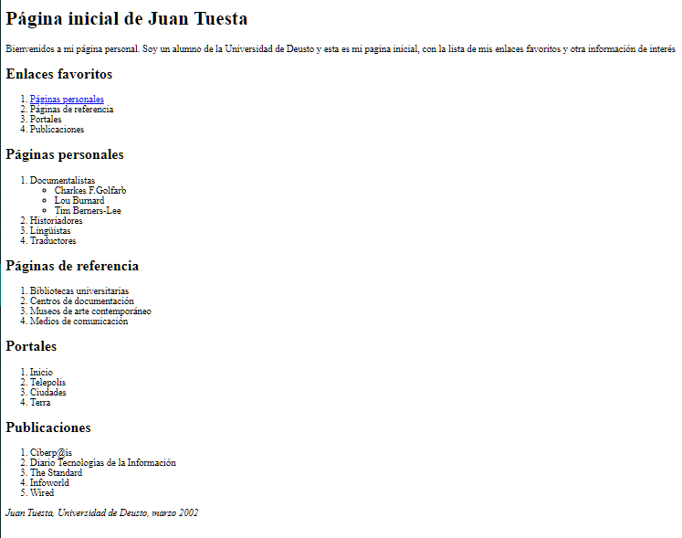
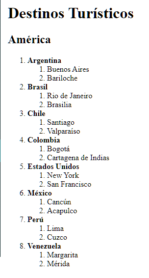
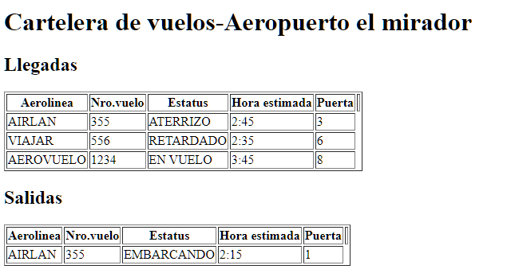
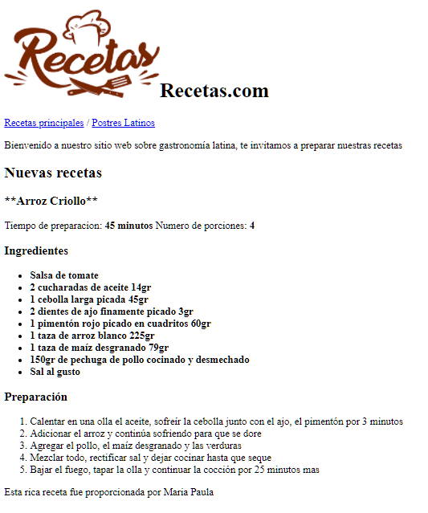
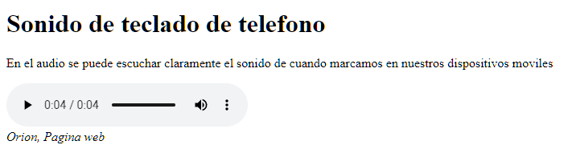
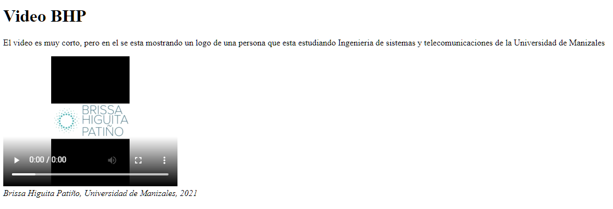

# EJERCICIOS JSX

##Integrante: Brissa Higuita Patiño

## EJERCICIO 1 

## EJERCICIO 2

## EJERCICIO 3

## EJERCICIO 4

## EJERCICIO 5

## EJERCICIO 6

## EJERCICIO 7

## EJERCICIO 8

## EJERCICIO 9

## EJERCICIO 10

## EJERCICIO 11

## EJERCICIO 12

## EJERCICIO 13

